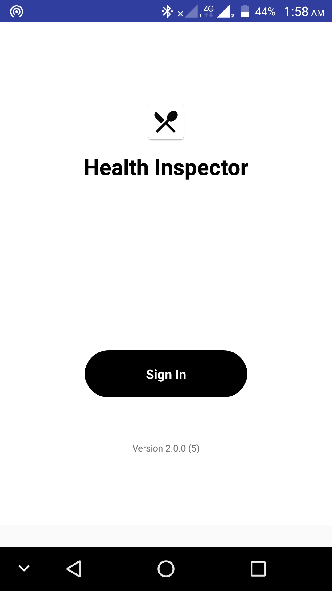
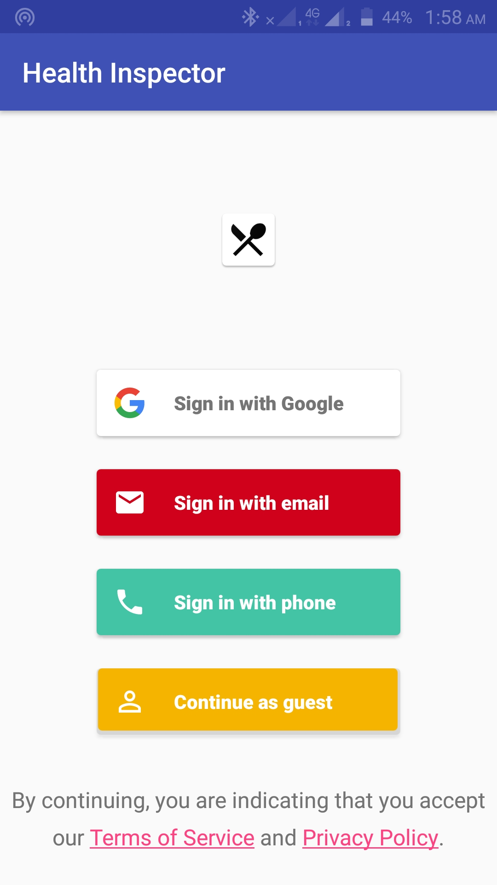
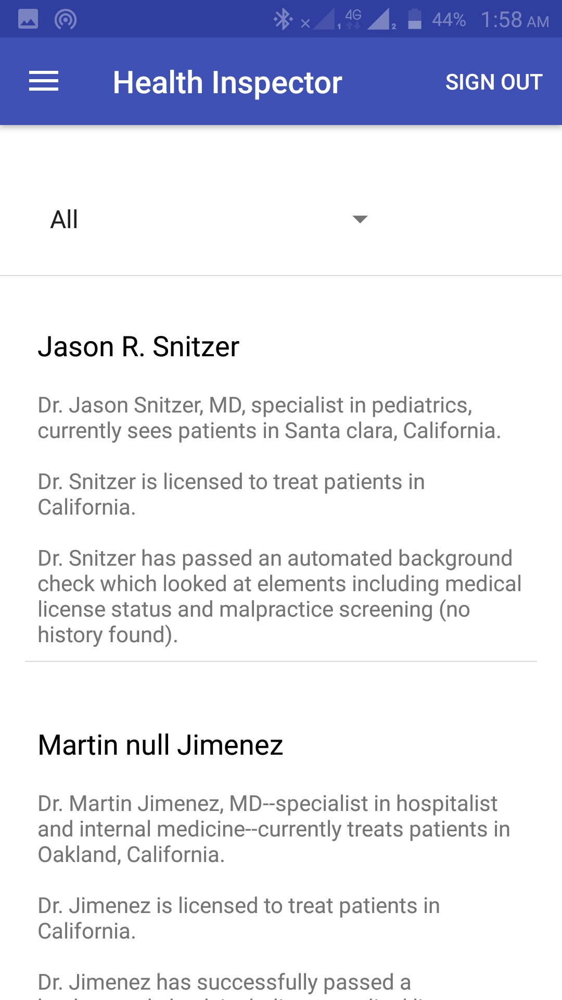
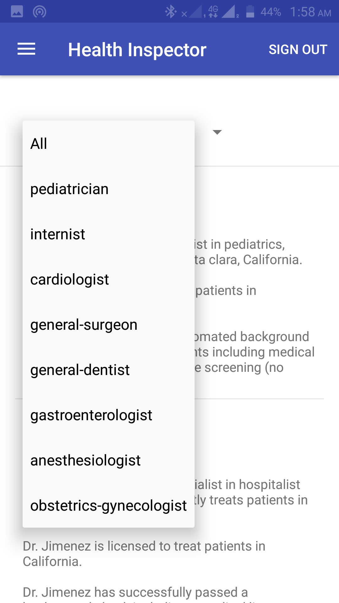
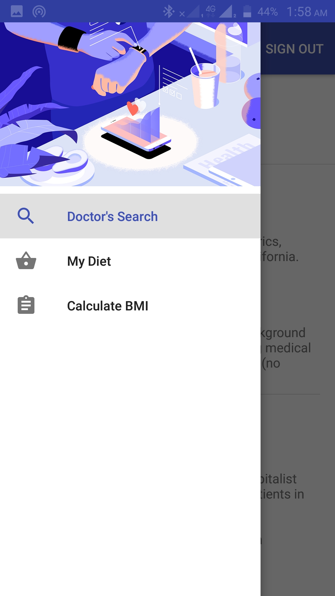
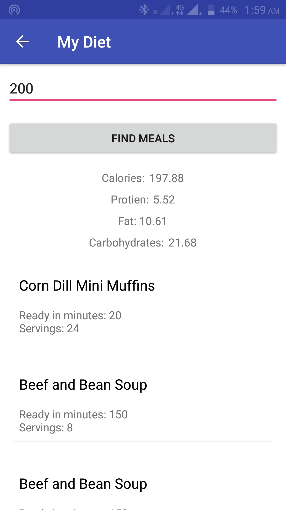
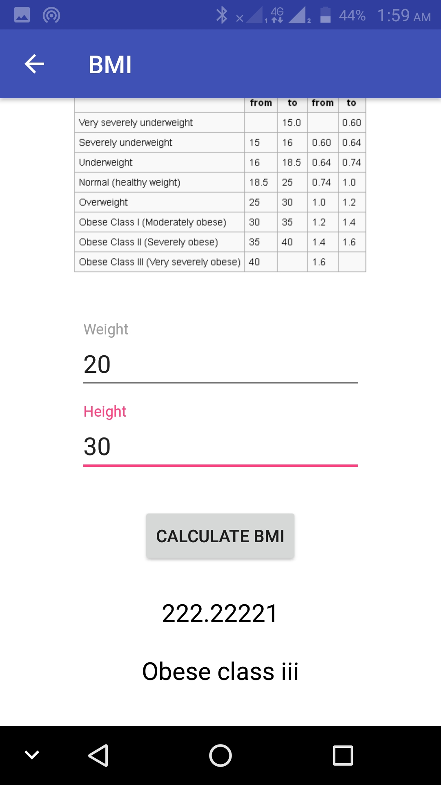
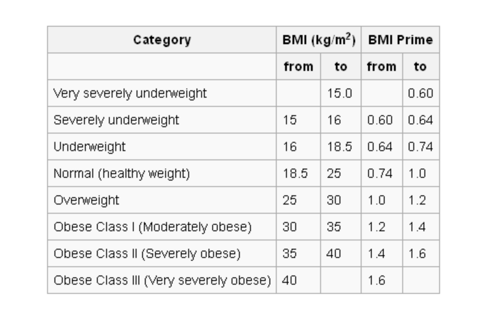

# Health Inspector
<b>Personal Health Care Companion</b>

<ul>
   <li>
 
 
</li>

<li>

</li>

</ul>

	
 
 
Health Inspector
 
 
Setup:
 
Android Studio:
 	
	Open Android Studio > Build > Edit Build Types > Signing > 
 	
<ol>
  <li>Key Alias: key0</li>
	<li>Key Password: password</li>
 <li>Store File: choose release.jks from app folder</li>
 <li>Store password: password</li>
 </ol>
  	
 	
In bottom left, choose build variants as Release
 	
Run the application
 	
 	
 	
<b>Libraries Used / Dependencies:</b>

Firebase Auth UI for social login.
 	
Retrofit, OkHTTP for making network calls
 	
GSON to parse JSON response to java object
 	
Google Maps API for location
 	
 	
 	
<b>Authentication:</b>
 	
•	Firebase Login UI Auth for social Login (Mobile, Email, Google Login) 	
•	Fetching SHA-1 for release.jks (check certificate.txt) and Substitute that SHA-1 value in firebase console for Authentication 	
•	Firebase SignOut 	
 	
 	
<b>Doctor Search with Better Doctors API:</b>
	
•	Drop down (Spinner) to specify specialization in doctor search query 	
•	Making REST Call with lat,lng, limit=10 and specialization 	
 		

@GET
https://api.betterdoctor.com/2016-03-01/doctors?location=37.773%2C-122.413%2C100&user_location=37.773%2C-122.413&skip=0&limit=10&user_key=76a2878a9e8d28dcd556ba0c53461174&specialty_uid=pediatrician
 	
And parsing it in Home Activity with RecyclerView
	

 	
<b>Calculating Meals for given target calories using Spoonacular API:</b>
 	
•	Taking Calories per day input through EditText 	
•	Making REST Call with target calories per day  	
 	
@GET
https://spoonacular-recipe-food-nutrition-v1.p.mashape.com/recipes/mealplans/generate?timeFrame=day&targetCalories=2000
+ 	
Pass Keys in header 	
X-Mashape-Key:  1Dnz7LuzBVmshia88a9IKqmf7n82p1v8KSGjsnP7R2gBashGJA (key) 	
X-Mashape-Host: spoonacular-recipe-food-nutrition-v1.p.mashape.com (key) 	
 	
And parsing it in MyDiet Activity with Recycler View and in Nutrients View
 	
 	
 	
<b>BMI Activity</b>
 	
 	
 	

 
Calculating BMI taking weight and height as inputs and using above table info.

Video link: https://youtu.be/6ON6F2VFWRA

PPT Link: https://drive.google.com/file/d/1Za9Cl7Vk9PdqqpZM1n_KIl3AevRPsQfO/view?usp=sharing
